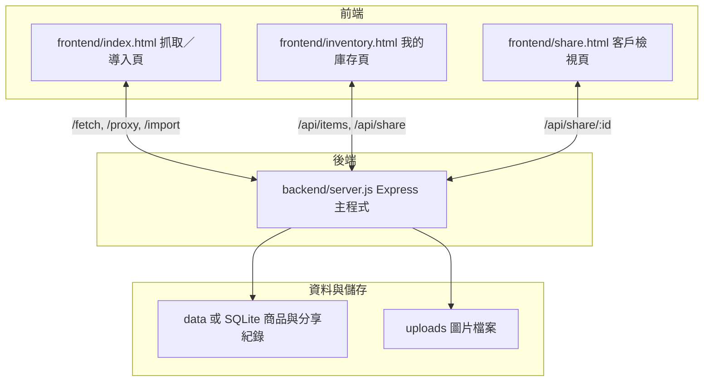
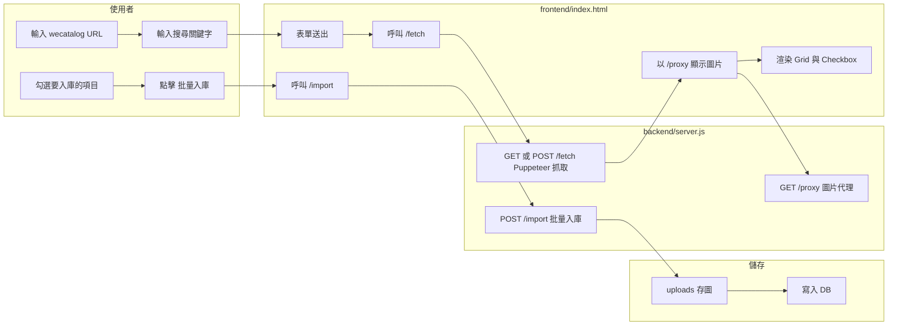
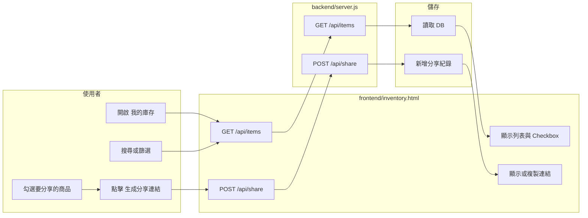
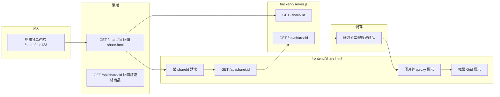
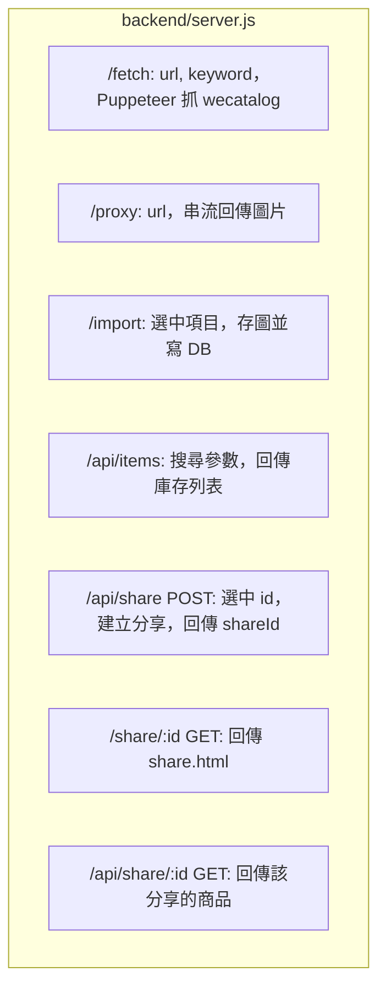

# Catalog Porter 運作邏輯流程圖

## 一、整體架構與檔案對應

---

## 二、頁面一：抓取／導入（index.html）

**涉及檔案：** `frontend/index.html`、`backend/server.js`、`uploads/`、資料庫

---

## 三、頁面二：我的庫存（inventory.html）

**涉及檔案：** `frontend/inventory.html`、`backend/server.js`、資料庫

---

## 四、頁面三：客戶檢視（share.html）

**涉及檔案：** `frontend/share.html`、`backend/server.js`、資料庫

---

## 五、後端 API 總覽（server.js）

---

## 六、檔案一覽

| 檔案或目錄 | 用途 |
|------------|------|
| backend/server.js | Express、所有 API、Puppeteer 抓取、靜態檔 |
| frontend/index.html | 抓取／導入頁：URL、關鍵字、勾選、批量入庫 |
| frontend/inventory.html | 我的庫存頁：搜尋、勾選、生成分享連結 |
| frontend/share.html | 客戶檢視頁：依 shareId 唯讀顯示 |
| uploads/ | 入庫圖片存放目錄 |
| data/ 或 SQLite | 商品表、分享表 |
| package.json | 依賴 express, puppeteer, axios, cors 等 |

---

確認邏輯沒問題後，再依此開始寫代碼。
